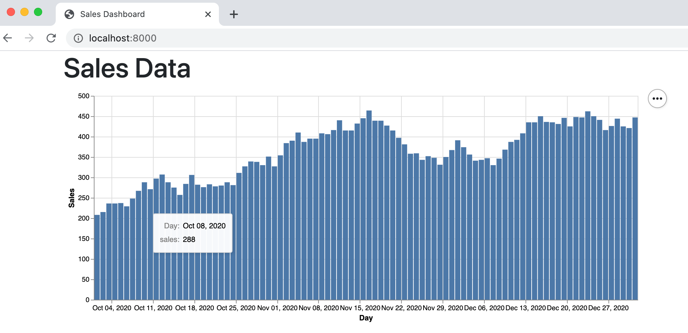

# Easy Data Viz in Django with Altair

One my favorite javascript libraries for data visualization is [Vega](https://vega.github.io/vega/)
and completely declarative grammar for creating interactive charts. You just use a JSON blob to declare what type of
chart you'd like, and the framework builds it for you.

There's a convenient Python library called [Altair](https://altair-viz.github.io/) which takes data represented in
Python (usually and Pandas dataframe) and turns it into a JSON blob that Vega can consume.

## Transforming Django ORM data into a Pandas Dataframe

Altair is built around Pandas Dataframes, so we're going to need to tranform the data we're using in our Django app into
a dataframe. In our [last post](unmanged_table_with_the_orm.md), I discussed accessing external data sources using an
unmanaged table. I'm going to continue on that work here and modify our `views.py` file.

```python
from django.shortcuts import render
from .models import SalesDay
import pandas as pd
import altair as alt


def sales_dashboard_view(request):
    days = SalesDay.objects.using("sales_db").filter()
    df = pd.DataFrame([[str(day.day), day.sales] for day in days],
                      columns=["day", "sales"])
    chart = alt.Chart(df).mark_bar().encode(
        alt.X('day:temporal', title="Day", timeUnit="utcyearmonthdate"),
        alt.Y("sales", title="Sales"),
        tooltip=[alt.Tooltip("day:temporal", title="Day", timeUnit="utcyearmonthdate"), alt.Tooltip("sales")]
    ).properties(width=800)

    return render(request, "sales_dashboard.html", {"chart": chart.to_json()})
```

First we unpack the [Queryset](https://docs.djangoproject.com/en/3.1/ref/models/querysets/) into a list, so that the
pandas dataframe can read it in. Then read the dataframe into altair with `alt.Chart(df)`. Finally, we encode the data.

Here `alt.X(...)` is just specifying the x-axis. Note that the `"day:temporal"` string is a way to specify that the
pandas column we're pulling from is "day" and the Altair data type of that column is "temporal". The full list of Altair
encoding data types is [here](https://altair-viz.github.io/user_guide/encoding.html#encoding-data-types).

Finally, we take to resulting chart and pass it to our Django context as json with```{"chart": chart.to_json()}`.

## Using vega in an HTML template

Now that we have passed the vegas json blob, we need to pull the vega library into our page and load the chart. In the
head of our HTML page, I'm adding the following:

```html
<script src="https://cdn.jsdelivr.net/npm/vega"></script>
<script src="https://cdn.jsdelivr.net/npm/vega-lite"></script>
<script src="https://cdn.jsdelivr.net/npm/vega-embed"></script>
```

Then in my body I create a div tag for where the chart will go:

```html
<div class="container">
    <h1>Sales Data</h1>
    <div id="my-chart"></div>
</div>
```

Then at the bottom of my body I actually run the `vegaEmbed` function on my json blob:
```html
<script type="application/javascript">
    let spec = {{ chart | safe }};
    vegaEmbed('#my-chart', spec);
</script>
```

Here I'm using the `safe` template tag in Django because the `chart` variable needs to load as valid JSON, not escaped
HTML characters.

## Final Result
When I run my page I shold have a nice chart of our sales data to look at:


