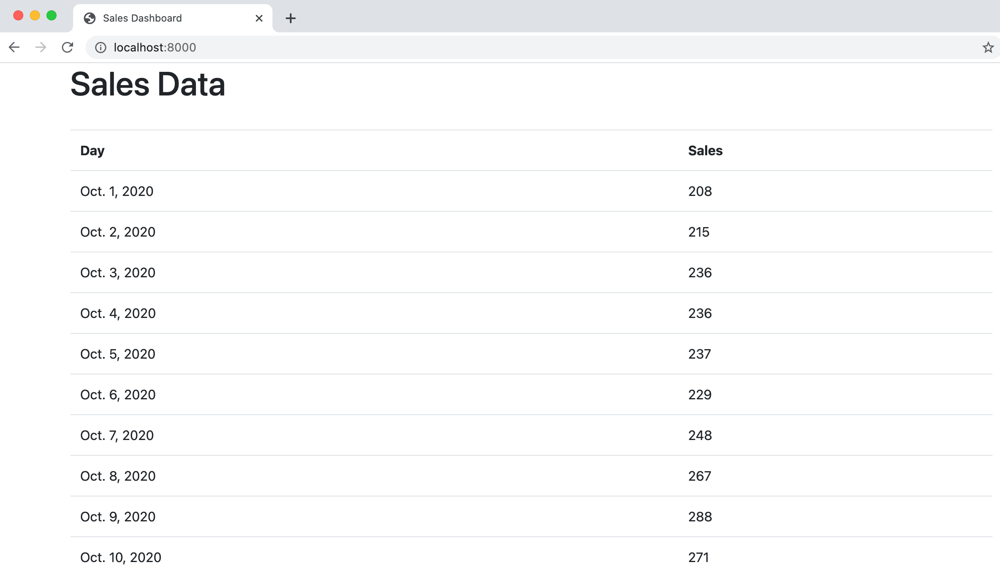

# Accessing External Data with Unmanaged Tables in the Django ORM

Sometimes when building our Django app, we'd like to access some existing external SQL dataset. It's easy
to access that data through Django's ORM (object relational mapper) using an unmanaged table. 

We'll walk through an example here of how we would pull some external sales data into a Django powered dashboard.
Imagine you have the following data in a Postgres or SQLite3 table. 

**2020 Q4 Sales Data**

|   Day    | Sales |
|----------|-------|
|2020-10-01|  208  |
|2020-10-02|  215  |
|2020-10-03|  215  |
|2020-10-04|  215  |
|2020-10-05|  215  |
|2020-10-06|  215  |
| ...      | ....  |
|2020-12-31|  447  |

For simplicity, I have added this data to an SQLite3 database called `sales.db` where this table is 
called `sales_2020Q4`. This would work the same way for Postgres or any of Django's [supported databases](https://docs.djangoproject.com/en/3.1/ref/databases/). 

## Add an additional database connection
In Django, you can have [multiple database backends](https://docs.djangoproject.com/en/3.1/topics/db/multi-db/).
You just need to add them to your `settings.py` file. In your `settings.py` file, go ahead and add an additional
database like this:

```python
DATABASES = {
    'default': {
        'ENGINE': 'django.db.backends.sqlite3',
        'NAME': BASE_DIR / 'db.sqlite3',
    },
    'sales_db': {     # This is our new database
        'ENGINE': 'django.db.backends.sqlite3',
        'NAME': 'sales.db'
    }
}
```

## Create the unmanaged model
Next, we'll head over to our `models.py` file and create an unmanaged model like this:

```python
class SalesDay(models.Model):
    day = models.DateField(primary_key=True)
    sales = models.PositiveIntegerField()

    class Meta:
        managed = False
        db_table = "sales_2020Q4"
```

Here are a few things to remember with an unmanaged model in Django:

- It will not create migrations for the model or manage the schema of the underlying table.
- The model's fields should be created to match the existing table's schema. 
- I recommend specifying all the fields in the database. If you don't the model will still work fine, but it 
  will be confusing for whoever reads your code next.
- It can create, update, and delete individual rows in the unmanaged table.
- The Django test tools will not create a test database for any unmanaged tables.

### A word about automatic primary keys
If you don't specify the primary key on `days` you'll get an error that says `no such column: sales_2020Q4.id`. 
You might ask, why is it looking for an `id` field? After all, I'm not using that field anywhere. When a table is 
managed by the ORM, it will create an [automatic primary key field](https://docs.djangoproject.com/en/3.1/topics/db/models/#automatic-primary-key-fields)
called `id`. So, because we didn't specify a primary key, the model assumes that there's a field called `id` which is 
primary key. Note that we can always access the primary key in a model by using the `.pk` field. 

### Specifying the database backend with the ORM
Because we have two databases backends, we have to specify which database we want our model [Manager](https://docs.djangoproject.com/en/3.1/topics/db/managers/) 
to talk to. We do that by calling `.using("sales_db")`method like this `first_sale = Salesday.objects.using("sales_db").first()`. 
If we don't do that, then it will assume we're using our default db, and it won't find the table.

(Another way we could specify the database backend is by using a [database router](https://docs.djangoproject.com/en/3.1/topics/db/multi-db/#database-routers).)

### Trying out the unmanaged model in the shell
I'd recommend using `python manage.py shell`, to experiment with your unmanaged model.

```python
>>> from sales_dashboard.models import SalesDay
>>> s = SalesDay.objects.first() # Fails because it's trying to use the "default" database
django.db.utils.OperationalError: no such table: sales_2020Q4

>>> s = SalesDay.objects.using("sales_db").first()
>>> s.day
datetime.date(2020, 10, 1)

>>> s.pk # Same as "day" because day is the primary key
datetime.date(2020, 10, 1)

>>> s.id # Fails because the model is not using automatic primary keys
AttributeError: 'SalesDay' object has no attribute 'id'
``` 

## Use the unmanaged model in our view
Next, let's build our view using the unmanaged model. 

```python
from django.shortcuts import render
from .models import SalesDay

def sales_dashboard_view(request):
    days = SalesDay.objects.using("sales_db").all()
    return render(request, "sales_dashboard.html", {"days": days})
```


## Create a template to display our model
Finally, let's create the `"sales_dashboard.html"` template that we referenced in our view. I'll just create a simple
[bootstrap table](https://getbootstrap.com/docs/4.0/content/tables/) to display the data like this:

```html
<!DOCTYPE html>
<html lang="en">
<head>
    <meta charset="UTF-8">
    <title>Sales Dashboard</title>
    <link rel="stylesheet" href="https://stackpath.bootstrapcdn.com/bootstrap/4.3.1/css/bootstrap.min.css"
          integrity="sha384-ggOyR0iXCbMQv3Xipma34MD+dH/1fQ784/j6cY/iJTQUOhcWr7x9JvoRxT2MZw1T" crossorigin="anonymous">
</head>
<body>
<div class="container">
    <h1>Sales Data</h1>
    <br/>
    <table class="table">
        <tr>
            <th>Day</th>
            <th>Sales</th>
        </tr>
        
            <tr>
                <td>{{ day.day }}</td>
                <td>{{ day.sales }}</td>
            </tr>
        
    </table>
</div>
</body>
</html>
```

Great! Now if we run our app, we can see the data appear in an HTML table like this:


