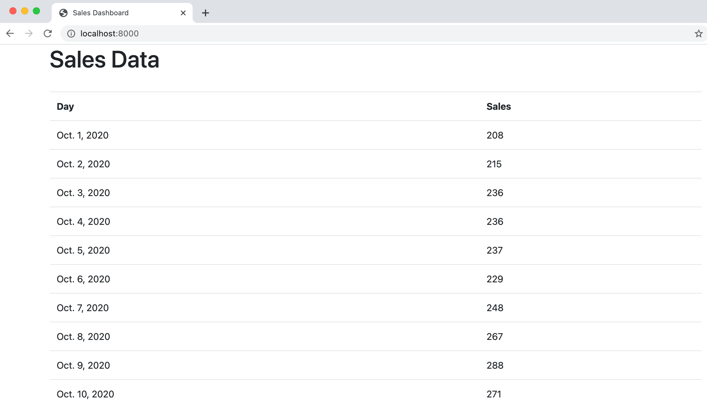

# Accessing External Data with Unmanaged Tables in the Django ORM

Sometimes when building our Django app, we'd like to access some existing external SQL dataset. It's easy
to access that data through Django's ORM (objet relational mapper) using un unmanaged table. 

We'll walk through an example here of how we would pull some external sales data into a Django powered dashboard.
Imagine you have the following data in a Postgres or SQLite3 table. 

**2020 Q4 Sales Data**

|   Day    | Sales |
|----------|-------|
|2020-10-01|  208  |
|2020-10-02|  215  |
|2020-10-03|  215  |
|2020-10-04|  215  |
|2020-10-05|  215  |
|2020-10-06|  215  |
| ...      | ....  |
|2020-12-31|  447  |

For simplicity, I have added this data to an SQLite3 database called `sales.db` where this table is 
called `sales_2020Q4`. This would work the same way for Postgres or any of Django's [supported databases](https://docs.djangoproject.com/en/3.1/ref/databases/). 

## Add an addition database connection
In Django, you can have [multiple database backends](https://docs.djangoproject.com/en/3.1/topics/db/multi-db/).
You just need to add them to your `settings.py` file. In your `settings.py` file, go ahead and add an additional
database like this:

```python
DATABASES = {
    'default': {
        'ENGINE': 'django.db.backends.sqlite3',
        'NAME': BASE_DIR / 'db.sqlite3',
    },
    'sales_db': {     # This is our new database
        'ENGINE': 'django.db.backends.sqlite3',
        'NAME': 'sales.db'
    }
}
```

## Create the unmanaged model
Next, we'll head over to our `models.py` file and create an unmanaged model like this:

```python
class SalesDay(models.Model):
    day = models.DateField(primary_key=True)
    sales = models.PositiveIntegerField()

    class Meta:
        managed = False
        db_table = "sales_2020Q4"
```

Here are a few things to remember with an unmanaged model in Django:

- It will not create migrations for the model or manage the schema of the underlying table.
- The model's fields should be created to match the existing table's schema.
- You should make sure to specify the primary key manually on the field that is the primary key.
- It can create, update, and delete individual rows in the unmanaged table.
- The Django test tools will not create a test database for any unmanged tables.

## Use the unmanaged model in our view
Next let's build our view using the unmanaged model. 

```python
def sales_dashboard_view(request):
    days = SalesDay.objects.using("sales_db").all()
    return render(request, "sales_dashboard.html", {"days": days})
```

Because we have two databases backends, it's important that we remember to specify call `.using("sales_db")`
method on our model manager. If we don't do that, then it will assume we're using our default db, and it won't
find the table.

## Create a template to display our model
Finally, let's create the `"sales_dashboard.html"` template that we referenced in our view. I'll just create a simple
[bootstrap table](https://getbootstrap.com/docs/4.0/content/tables/) to display the data like this:

```html
<!DOCTYPE html>
<html lang="en">
<head>
    <meta charset="UTF-8">
    <title>Sales Dashboard</title>
    <link rel="stylesheet" href="https://stackpath.bootstrapcdn.com/bootstrap/4.3.1/css/bootstrap.min.css"
          integrity="sha384-ggOyR0iXCbMQv3Xipma34MD+dH/1fQ784/j6cY/iJTQUOhcWr7x9JvoRxT2MZw1T" crossorigin="anonymous">
</head>
<body>
<div class="container">
    <h1>Sales Data</h1>
    <br/>
    <table class="table">
        <tr>
            <th>Day</th>
            <th>Sales</th>
        </tr>
        
            <tr>
                <td>{{ day.day }}</td>
                <td>{{ day.sales }}</td>
            </tr>
        
    </table>
</div>
</body>
</html>
```

Great! Now if we run our app, we can see the data appear in an html table like this:


